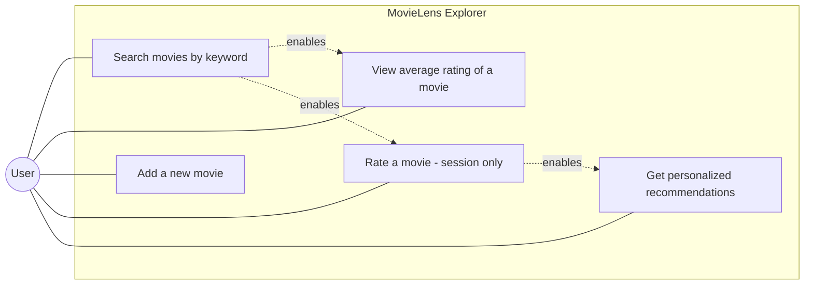
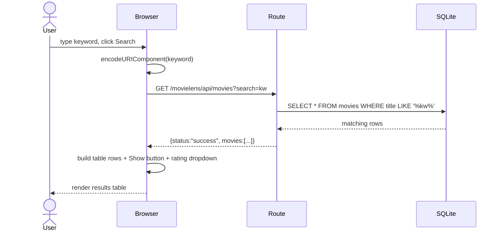
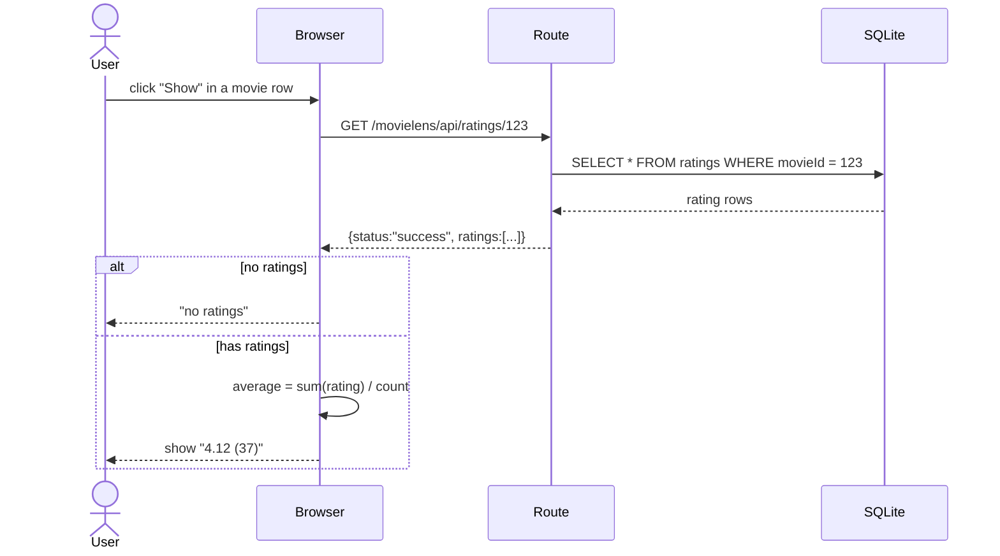
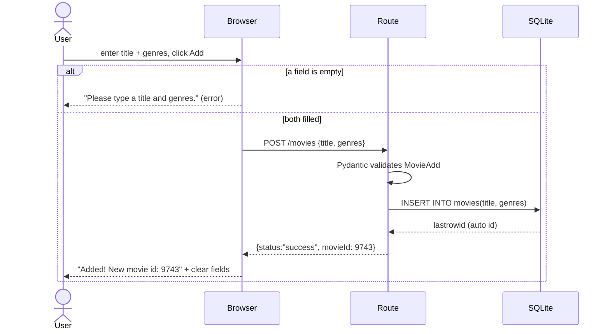
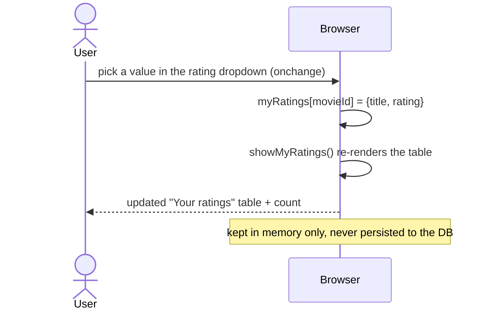
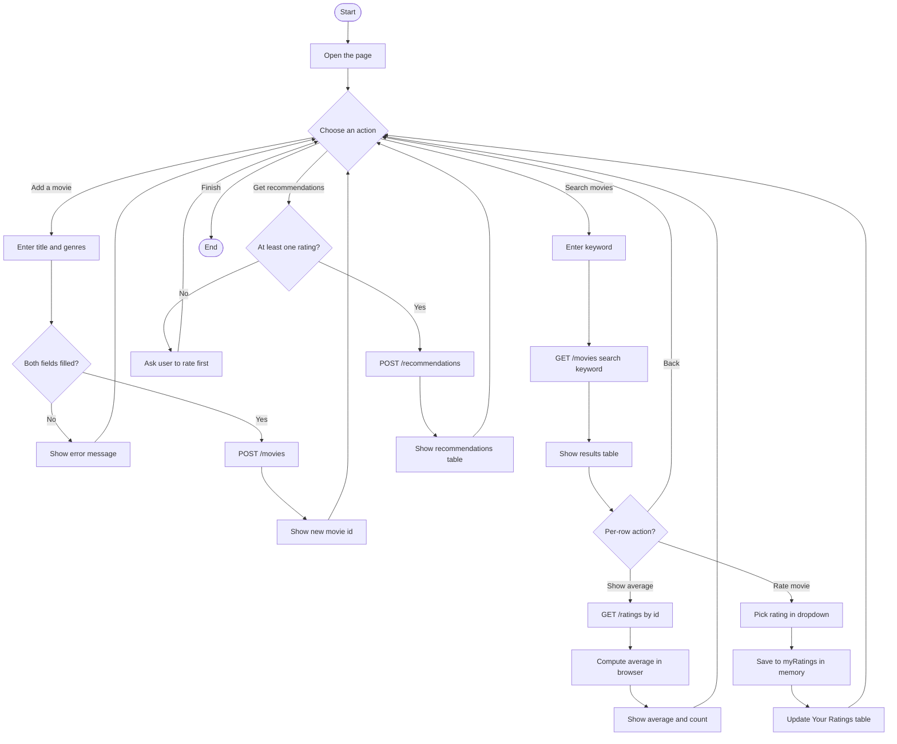
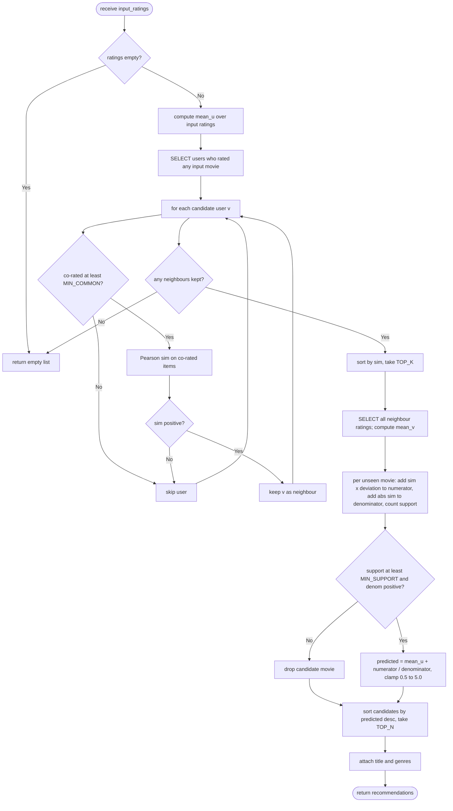
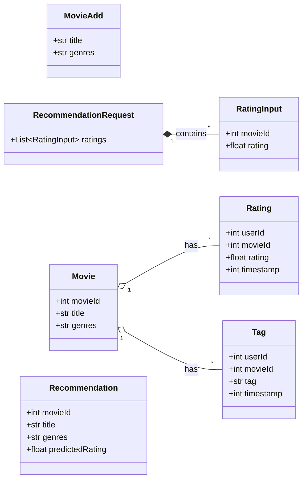
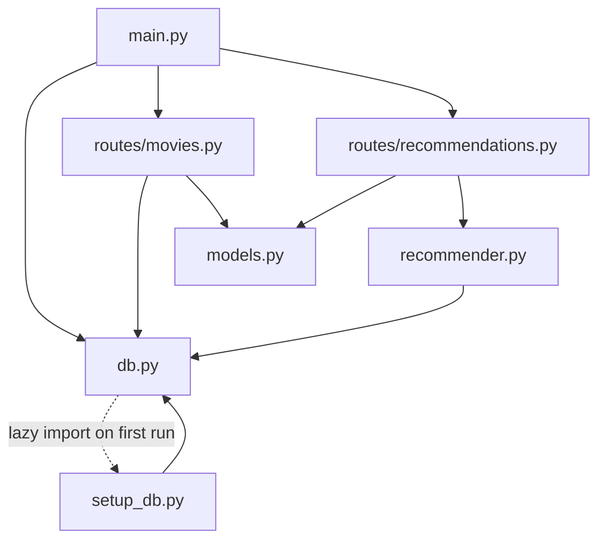

# MovieLens Explorer — UML Diagrams

UML models of the whole application, each paired with a **"flow in the code"** map
(file → function → line) so every arrow can be traced to real code.

> Diagrams are written in **Mermaid**, which GitHub renders automatically. To
> preview locally, use VS Code with a Mermaid markdown extension.
>
> **Formal UML (PlantUML) versions** of every diagram are in
> [`plantuml/`](plantuml/) — use those for textbook notation (stick-figure
> actors, ovals, `«stereotypes»`). See [`plantuml/README.md`](plantuml/README.md)
> for how to render them.

Code lives in `backend/src/` (FastAPI + SQLite) and `frontend/` (vanilla JS).

---

## 0. All possible flows (overview)

| # | Flow | Trigger | Server endpoint | Code entry point |
|---|------|---------|-----------------|------------------|
| 1 | Add a movie | "Add" button | `POST /movies` | `index.js addMovie()` → `routes/movies.py add_movie()` |
| 2 | Search movies | "Search" button | `GET /movies?search=` | `index.js searchMovies()` → `routes/movies.py search_movies()` |
| 3 | View average rating | "Show" button in a row | `GET /ratings/{id}` | `index.js showAverage()` → `routes/movies.py get_ratings()` |
| 4 | Rate a movie | rating dropdown | *(none — client only)* | `index.js rateMovie()` / `removeRating()` |
| 5 | Get recommendations | "Get recommendations" button | `POST /recommendations` | `index.js getRecommendations()` → `routes/recommendations.py` → `recommender.recommend()` |
| 6 | First-run DB build | server startup | *(lifespan)* | `main.py lifespan` → `db.init_database()` → `setup_db.initialize_db()` |

Each network flow also has **branches**: input-validation failure, empty/zero
results, and "server unreachable" (the `fetch` `catch` block). These are shown in
the sequence and activity diagrams.

---

## 1. Use Case Diagram

Who does what. One actor (the web-app **User**); five user-facing use cases plus
the implicit startup behaviour. Dotted arrows show workflow prerequisites
(not strict UML «include», but the order the UI enforces).



**Flow in the code**

- `uc1 Search` → `frontend/index.js:51 searchMovies()` → `backend/src/routes/movies.py:22 search_movies()`
- `uc2 Average` → `frontend/index.js:95 showAverage()` → `backend/src/routes/movies.py:42 get_ratings()` (average is computed **in the browser** from the returned ratings)
- `uc3 Add` → `frontend/index.js:22 addMovie()` → `backend/src/routes/movies.py:58 add_movie()`
- `uc4 Rate` → `frontend/index.js:118 rateMovie()` (stored in the in-memory `myRatings` object, never sent until recommendations)
- `uc5 Recommend` → `frontend/index.js:149 getRecommendations()` → `backend/src/routes/recommendations.py:18` → `backend/src/recommender.py:71 recommend()`
- *Enables* edges reflect the UI: you must **search** before a row exposes the "Show average"/rating controls, and you must **rate** at least one movie before recommendations are allowed (`index.js:159`).

---

## 2. Sequence Diagrams (one per flow)

Participants map to: **Browser** = `frontend/index.js`, **Route** =
`backend/src/routes/*`, **Recommender** = `backend/src/recommender.py`,
**SQLite** = `movielens.db` via `db.get_db()`.

### 2.1 Search movies — `GET /movies?search=`



**Flow in the code:** `searchMovies()` `index.js:51` builds the URL and calls
`callApi()` `index.js:16`; `search_movies()` `routes/movies.py:22` runs the
`LIKE` query (case-insensitive for ASCII); rows become dicts via
`dict(m)` and the loop at `index.js:62` renders them, remembering each in
`searchedMovies` for later rating.

### 2.2 View average rating — `GET /ratings/{movieId}`



**Flow in the code:** `showAverage(movieId, button)` `index.js:95` calls
`get_ratings()` `routes/movies.py:42`. The **average is NOT computed on the
server** — the endpoint returns raw ratings and the browser averages them at
`index.js:106-111`. (Note: query column is `movieId`, matching the schema.)

### 2.3 Add a movie — `POST /movies`



**Flow in the code:** client-side guard at `index.js:28`; `add_movie(movie:
MovieAdd)` `routes/movies.py:58` relies on `movieId INTEGER PRIMARY KEY` so
SQLite assigns the next id, returned via `cursor.lastrowid` `routes/movies.py:74`.

### 2.4 Rate a movie — client only (no server)



**Flow in the code:** dropdown built by `ratingDropdown()` `index.js:84`;
selecting fires `rateMovie()` `index.js:118` which writes to the in-memory
`myRatings` object `index.js:10`; `removeRating()` `index.js:143` deletes an
entry. This satisfies the spec: session ratings live in the browser only.

### 2.5 Get recommendations — `POST /recommendations`

```mermaid
sequenceDiagram
    actor User
    participant JS as Browser
    participant API as Route
    participant REC as Recommender
    participant DB as SQLite
    User->>JS: click "Get recommendations"
    JS->>JS: build ratings[] from myRatings
    alt no ratings yet
        JS-->>User: "Please rate at least one movie first."
    else
        JS->>API: POST /recommendations {ratings:[...]}
        API->>API: validate RecommendationRequest
        API->>REC: recommend([(movieId, rating), ...])
        REC->>DB: SELECT ratings WHERE movieId IN (input movies)
        DB-->>REC: overlapping users' ratings
        REC->>REC: Pearson sim per user; keep positive, at least MIN_COMMON co-rated
        REC->>REC: sort, take TOP_K neighbours
        REC->>DB: SELECT ratings WHERE userId IN (neighbours)
        DB-->>REC: neighbour ratings, compute mean_v
        REC->>REC: predict per unseen movie; filter MIN_SUPPORT; take TOP_N
        REC->>DB: SELECT title, genres WHERE movieId IN (top ids)
        DB-->>REC: movie info
        REC-->>API: [{movieId, title, genres, predictedRating}]
        API-->>JS: {status:"success", recommendations:[...]}
        JS->>JS: build table rows
        JS-->>User: render recommendations
    end
```

**Flow in the code:** `getRecommendations()` `index.js:149` (guard at `:159`)
→ `get_recommendations()` `routes/recommendations.py:18` → `recommend()`
`recommender.py:71`. The two DB reads correspond to step 1 (`:88-98`, who
overlaps) and step 3 (`:124-132`, neighbour ratings); the final read attaches
titles (`:167-173`). Ratings are read-only — **nothing is written**.

---

## 3. Activity Diagrams

### 3.1 Whole-app user session



**Flow in the code:** the decision nodes map to guards — `A2` = `index.js:28`,
`G1` = `index.js:159`. `E2` (average computed in browser) = `index.js:106-111`.
`F2` (memory only) = `index.js:118-122`.

### 3.2 Recommendation algorithm internals (`recommend()`)



**Flow in the code:** `B` = `recommender.py:79`; `C` = `:82`; `D` = step 1
`:88-98`; `F` = `MIN_COMMON` check `:104`; `H` = `_pearson()` `:50-68`;
`I` = `sim > 0` `:110`; `L` = top-K `:117-119`; `M` = `:124-136`;
`N` = step 4 `:142-150`; `O` = `MIN_SUPPORT` / `den` check `:155`;
`Q` = predict + clamp `:157` and `:184`; `R` = top-N `:160-161`.

---

## 4. Class Diagram

The backend is module-based, so the "classes" are of three kinds:
**Pydantic request models** (real classes), **persistent entities** (the SQLite
tables), and the **response DTO** (the recommendation dict shape).



**Flow in the code / notes**

- `MovieAdd`, `RatingInput`, `RecommendationRequest` → `backend/src/models.py:14, 21, 28` (Pydantic; validate request bodies automatically).
- `Movie`, `Rating`, `Tag` → table schemas in `backend/src/setup_db.py:64-94`.
  - **Primary keys:** `Movie(movieId)`, `Rating(userId, movieId)`, `Tag(userId, movieId, tag)`.
- `Recommendation` → the dict produced at `backend/src/recommender.py:178-186` and returned in the API response (not a declared class, but the response shape the spec requires).

### 4.1 Module dependency view (bonus — backend architecture)



**Flow in the code:** `main.py:51-52` mounts both routers under `/movielens/api`;
`db.py:51` lazily imports `setup_db` only on first run to avoid a circular import
(`setup_db` imports `BASE_DIR`/`DB_PATH` from `db`).
